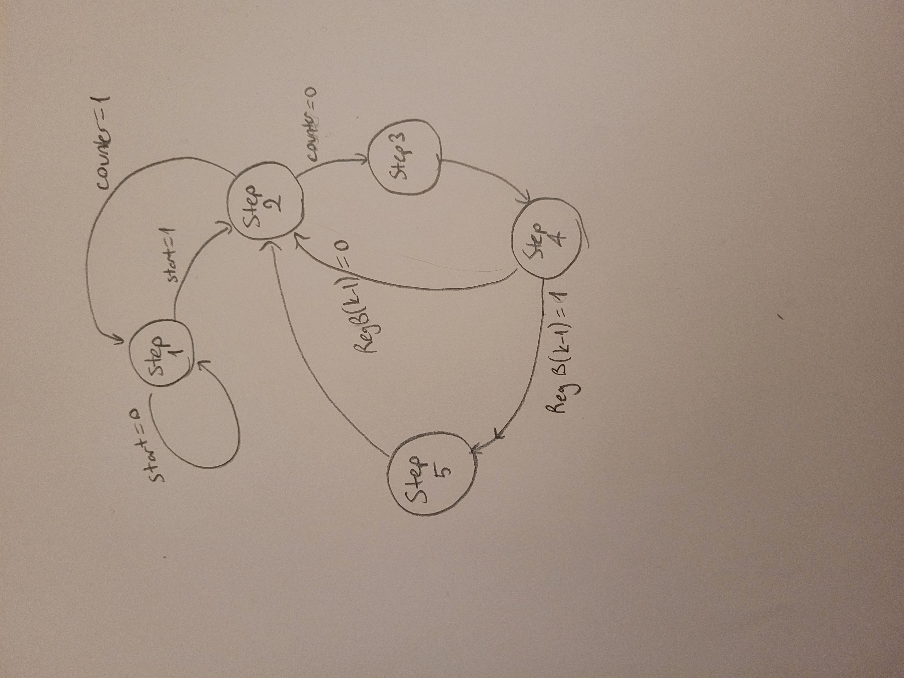
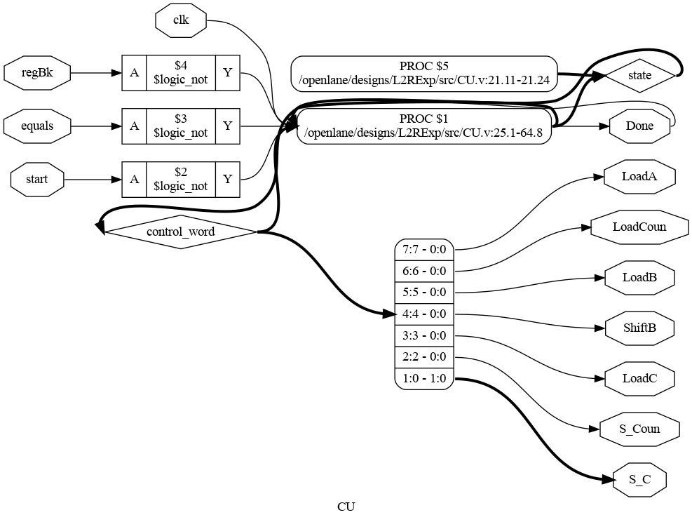
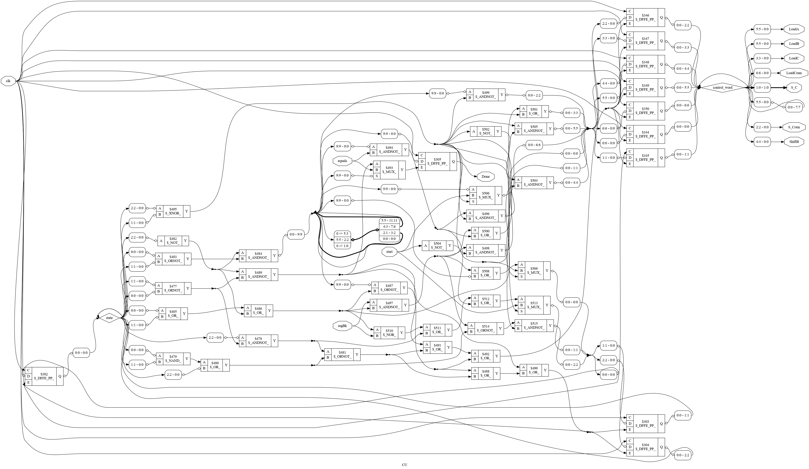
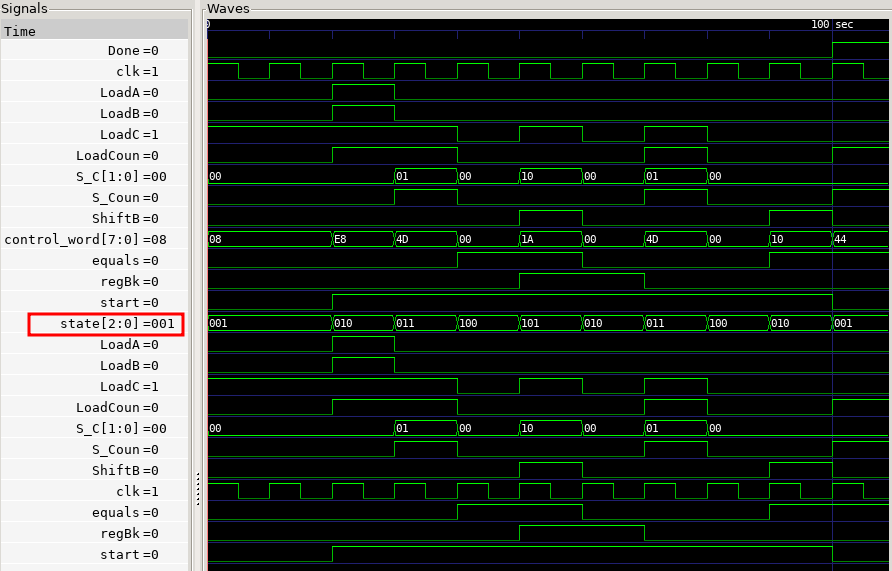
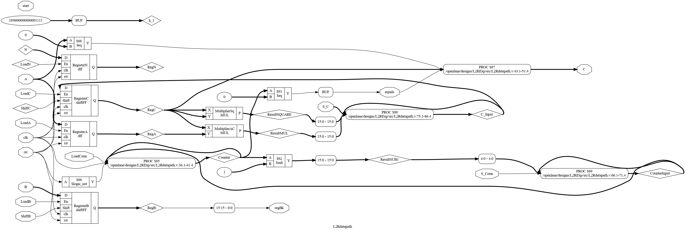
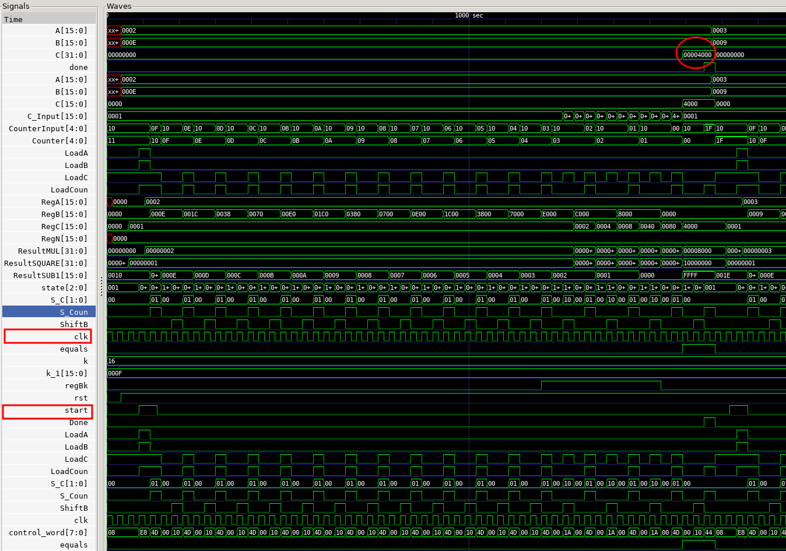
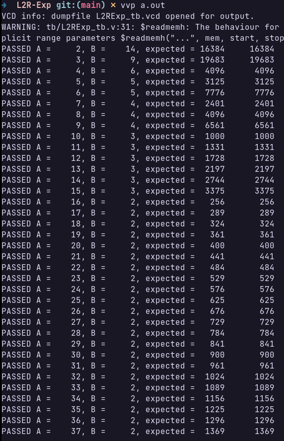
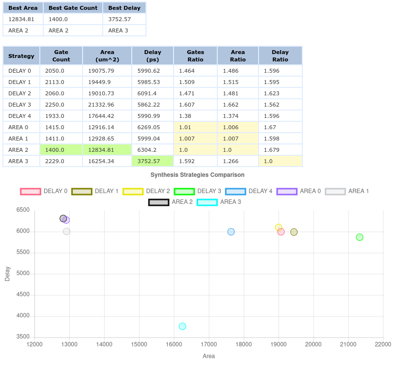
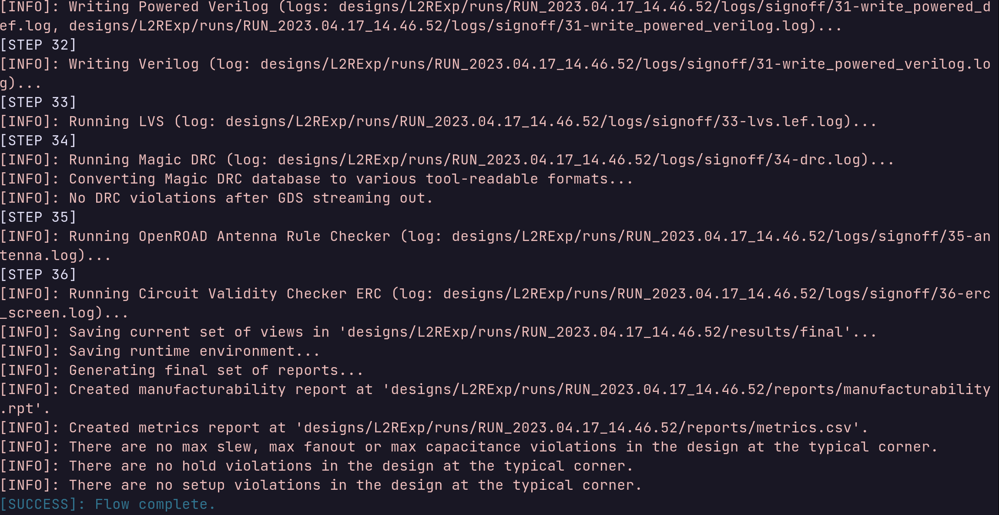

# Left To Right Exponentiation Circuit

## Control Unit

### State Diagram


### RTL Schematic
Controller's hierarchy schematic.


Controller's post-techmap schematic.


### Simulation


## Datapath

### RTL Schematic
Datapath's hierarchy schematic.



Datapath's post-techmap schematic.


### Simulation
Most of the signals are shown in waveform, when simulated for a single input of A and B:


Test vectors are generated using Python which follows the given algorithm in MATLAB.

```python
import numpy as np

AB_array = np.zeros((2**8-1, 3), dtype=np.uint16)

for A in range(2, 2**16):
    for B in range(2, 2**16):
        if A**B > 2**16-1:
            break
        AB_array[A-2, 0] = np.uint16(A)
        AB_array[A-2, 1] = np.uint16(B-1)
        AB_array[A-2, 2] = np.uint16(A**(B-1))

with open('L2RExp_tb.hex', 'w') as f:
    for row in AB_array:
        f.write('{:04X}_{:04X}_{:04X}\n'.format(row[0], row[1], row[2]))

print(AB_array)
```

Self-checking testbench is used to print whether the resulting value from the module is correct or not.
The testbench prints "PASS" or "Test failed" by comparing the expected and obtained values.

Here is the standard output from the Self-checking testbench:



## OpenLane Flow

The first error was about setup and hold timing violations. As I observed from the reports, the worst negative slack was at most -2.0 ns. To compensate it, the clock period is increased from 10ns to 12.5 ns in `config.json` file.

The second was a warning about max fanout violation, I handled it by introducing `SYNTH_MAX_FANOUT` to be equal to 20 instead of the default value of 10.

To mitigate timing violations and increase the performance of the circuit, exploratory analysis is done.
- Checking optimal synthesis strategy using `./flow.tcl -design L2RExp -synth_explore`



The most favoured strategies were selected as "AREA 3" for delay optimizations and "AREA 2" for area optimizations. "AREA 3" is preferred as the area is not as constrained as timing in this design.

The resulting standard output from the OpenLane Flow which tells there is no DRC, LVS antenna violations is below.



### Metrics
According to `25-rcx_sta.worst_slack.rpt` report file setup worst slack was 0.17 and hold slack was 0.20 ns. Considering the clock period was given as 12.5ns, the minimum supported clock period of the circuit is $12.5 - 0.17 = 12.33$. This results in the maximum clock frequency of 81 MHz.

The `25-rcx_sta.area.rpt` report states that the area used is 13387 u^2 with 38% utilization.

My resulting OpenLane `config.json` is below:

```json
{
    "DESIGN_NAME": "L2RExp",
    "VERILOG_FILES": "dir::src/*.v",
    "CLOCK_PORT": "clk",
    "CLOCK_PERIOD": 12.5,
    "DESIGN_IS_CORE": true,
    "SYNTH_STRATEGY": "AREA 3",
    "SYNTH_MAX_FANOUT": 20
}
```
Post P&R simulation is not successful as the signals are shown as not connected. The methodology for post synthesis and post p&r might differ so much that we might need additional source files for simulation which I am not aware of.


# Appendix 
## How to Run OpenLane

Initialise the OpenLane environment by calling `make mount` in the OpenLane directory.

```shell
./flow.tcl -design L2RExp -init_design_config -add_to_designs
```
OpenLane will have a persistent volume in the host machine. Place your design files in `OpenLane/designs/L2RExp/src` folder.

To obtain RTL schematics, run the flow to synthesis.

```shell
./flow.tcl -design L2RExp -to_synthesis
```


